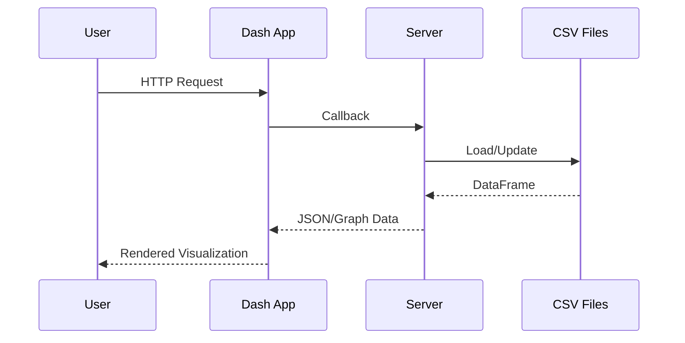

# Architecture

## Components
```mermaid
graph TD
  A[Browser] --> B[Dash App (app.py)]
  B --> C[Flask Server]
  C --> D[Data Files]
  C --> E[ML & Monitoring Modules]
  C --> F[REST API /api.py]
```

## Request Flow


## Deployment
- Docker image defined in `Dockerfile` (Python 3.11).
- `docker-compose.yml` for local services.
- GitHub Actions build & test workflows.

